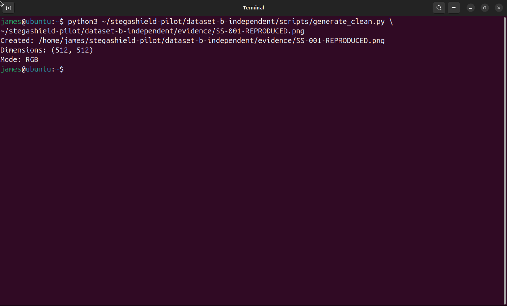
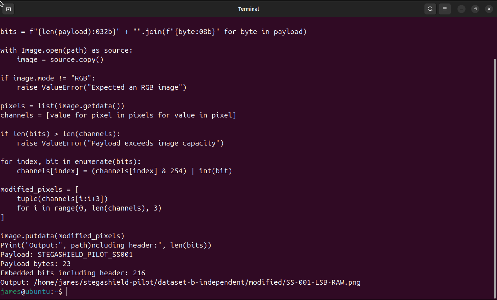
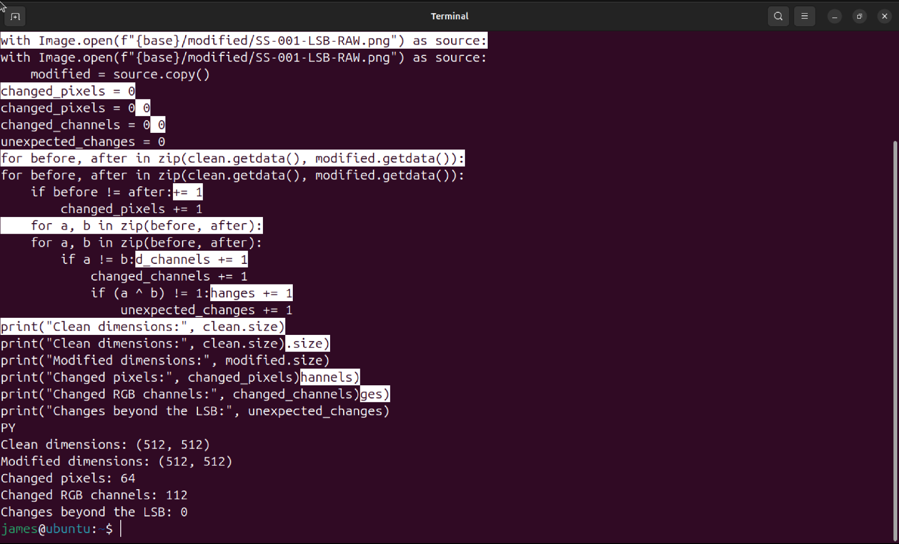
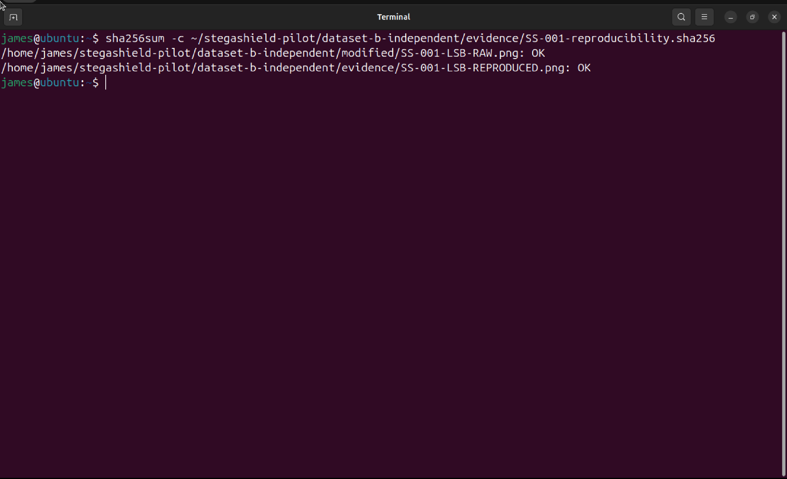
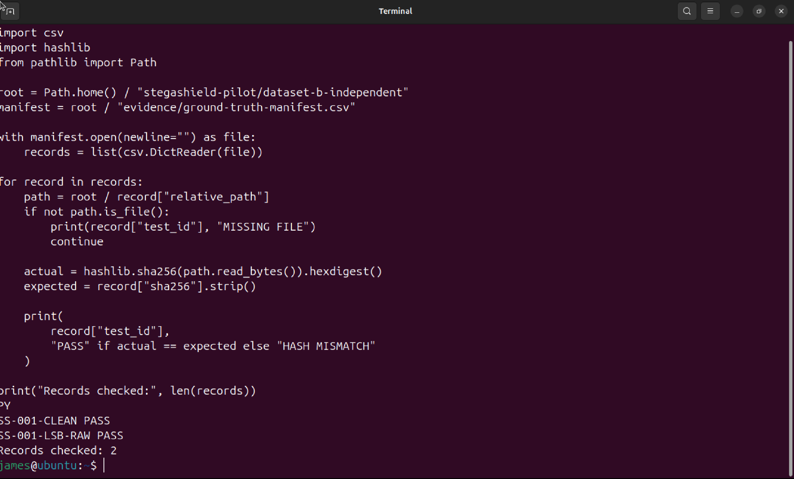

# StegaShield SOC Validation Pilot
## Dataset Ground Truth and Independent LSB Validation

**Project:** StegaShield SOC Detection Validation Pilot  
**Day:** 02 of 07  
**Focus:** Dataset analysis, independent ground truth, LSB embedding, integrity verification, and reproducibility  
**Environment:** Ubuntu 24.04.5 LTS, ARM64  
**Status:** Technical investigation completed. Repository evidence verification pending.

---

## 1. Investigation Objective

Before testing StegaShield, I needed to establish something fundamental:

**How can I determine whether StegaShield correctly identifies a modified image if I have not independently established which images are clean and which contain hidden data?**

My objective for Day 2 was to:

1. Examine the team-linked reference dataset.
2. Understand its structure and potential validation limitations.
3. Create an independent clean image.
4. Embed a controlled payload using LSB substitution.
5. Verify the embedded payload and actual pixel changes.
6. Preserve SHA-256 fingerprints.
7. Reproduce the experiment.
8. Establish a ground-truth manifest before model testing.

The investigation deliberately separates known ground truth from future detector predictions.

---

## 2. Dataset Strategy

I separated the investigation into two datasets.

### Dataset A — Team-Linked Reference Dataset

Source:

https://www.kaggle.com/datasets/marcozuppelli/stegoimagesdataset/data

The StegaShield team identified this dataset as material used during training and testing.

Therefore, I am using it to understand the expected image structures and reproduce known conditions, **not as independent evidence of model generalization**.

### Dataset B — Independent Validation Dataset

I constructed a separate controlled dataset on Ubuntu.

Its purpose is to establish ground truth without relying on StegaShield's predictions.

The first controlled pair consists of:

| Test ID | Ground Truth | Description |
|---|---|---|
| SS-001-CLEAN | CLEAN | Original synthetic RGB image |
| SS-001-LSB-RAW | MODIFIED | Same parent image with controlled raw payload embedded using RGB LSB substitution |

This first pair is a reproducible proof of methodology, not a statistically representative validation population.

---

## 3. Dataset A — Reference Dataset Investigation

### 3.1 Dataset population

Archive inspection and metadata reconciliation established the following image populations:

| Partition | Clean | Standard Stego | Base64 Variant | ZIP Variant |
|---|---:|---:|---:|---:|
| Train | 4,000 | 12,000 | — | — |
| Validation | 2,000 | 6,000 | — | — |
| Test | 2,000 | 6,000 | 6,000 | 6,000 |
| **Total** | **8,000** | **24,000** | **6,000** | **6,000** |

**Total archive image population: 44,000.**

The metadata CSV describes the ordinary clean and stego populations, while the archive contains additional Base64 and ZIP test variants.

The payload categories in the metadata include:

- JavaScript
- JavaScript in HTML
- PowerShell
- Ethereum addresses
- URL/IP addresses

These are payload categories, not necessarily distinct steganographic embedding algorithms.

### 3.2 Important finding — RGB versus RGBA separation

PNG-header inspection revealed a systematic structural difference.

| Dataset label | PNG color structure | Observed count |
|---|---|---:|
| Clean | RGBA | 8,000 |
| Stego, including variants | RGB | 36,000 |

All inspected clean files used RGBA, while all inspected stego files used RGB.

This creates a **potential dataset confounding variable**.

A classifier evaluated on this dataset could theoretically distinguish the classes using PNG color type rather than identifying the intended steganographic modifications.

However, this investigation does **not** establish that StegaShield relies on this shortcut.

That question requires controlled model testing.

### 3.3 Candidate parent and stego relationship

The reference dataset contains files with matching numerical identifiers.

Example:

```text
04001.png
image_04001_eth_0.png
image_04001_html_0.png
image_04001_url_0.png
```

The shared identifier suggests a possible clean-parent relationship.

For one candidate pair:

`04001.png` and `image_04001_eth_0.png`

The comparison found:

| Measurement | Result |
|---|---:|
| Dimensions | 512 × 512 |
| Changed RGB pixels | 106 |
| Changed RGB channels | 156 |
| Changes outside bit 0 | 0 |
| Red channel changes | 48 |
| Green channel changes | 50 |
| Blue channel changes | 58 |

All changed pixels occurred in the first image row.

These observations are consistent with sequential LSB substitution, but they do not independently establish the complete dataset-generation algorithm.

### 3.4 Dataset A interpretation

**Observed**

- Clean and stego labels perfectly corresponded to RGBA and RGB PNG color types in the inspected archive.
- The examined candidate image pair differed only in RGB bit 0.
- The observed changes were concentrated in the first row.

**Interpretation**

The reference dataset contains an image-format difference that could confound model evaluation.

**Unknown**

- Whether StegaShield's preprocessing retains or removes this difference.
- Whether the model uses PNG color structure as a classification shortcut.
- Whether the observed sample-generation pattern applies identically to every embedding variant.

**Engineering decision:** Do not use Dataset A alone to establish independent detection accuracy.

---

## 4. Dataset B — Independent Ground Truth

### 4.1 Controlled workspace

The independent dataset was created under:

```text
~/stegashield-pilot/dataset-b-independent/
```

The workspace separates:

```text
dataset-b-independent/
├── clean/
├── modified/
├── scripts/
└── evidence/
```

This keeps original samples, modified samples, reproducibility scripts, and supporting evidence logically separated.

### 4.2 Clean image generation

The first clean image was generated using:

- Python 3.12.3
- Pillow 10.2.0
- Fixed random seed: `20261007`
- Image dimensions: 512 × 512
- Color mode: RGB
- Output format: PNG

The generator uses deterministic pseudorandom RGB values.

The clean image was generated without intentionally embedding a hidden payload.

**Limitation:** A synthetic noise-like image is not equivalent to a natural photograph. Its statistical characteristics may affect future detector scores.

The creation method was preserved in:

`scripts/generate_clean.py`

### Evidence 01 — Independent clean-image creation



The screenshot documents the original controlled image creation and its reported dimensions and RGB mode.

---

## 5. Controlled LSB Embedding

### 5.1 Payload

The controlled test payload was:

```text
STEGASHIELD_PILOT_SS001
```

| Property | Value |
|---|---|
| Payload length | 23 bytes |
| Payload preparation | Raw text |
| Embedding method | RGB least significant bit |
| Length header | 32 bits |
| Total embedded bits | 216 |

The original clean image was preserved.

The modified image was created as:

`modified/SS-001-LSB-RAW.png`

### 5.2 Embedding method

The embedding script writes payload bits sequentially into RGB channel values.

The central operation is:

```python
channels[index] = (channels[index] & 254) | int(bit)
```

The operation clears the lowest bit and replaces it with the intended payload bit.

It does not intentionally modify the other seven bits of a channel.

The script was preserved as:

`scripts/embed_lsb.py`

### Evidence 02 — Controlled LSB embedding



The screenshot documents the payload length, total embedded bits, and generated modified-image path.

---

## 6. Independent Payload and Pixel Verification

After creating the modified image, I verified that the payload could be recovered by reading its RGB least significant bits.

The extraction returned:

```text
Declared payload length: 23
Recovered payload: STEGASHIELD_PILOT_SS001
Matches expected: True
```

I then compared the clean and modified images.

| Measurement | Observed result |
|---|---:|
| Clean dimensions | 512 × 512 |
| Modified dimensions | 512 × 512 |
| Changed pixels | 64 |
| Changed RGB channels | 112 |
| Changes beyond the LSB | 0 |

The difference between 216 embedded bit positions and 112 changed channel values is expected.

Writing a payload bit does not change a channel when its existing lowest bit already matches the intended value.

### Evidence 03 — Payload recovery and pixel verification



The selected screenshot documents the actual pixel-comparison results. Payload recovery is recorded separately in the investigation observations.

### Interpretation

The modified image contains a recoverable controlled payload.

All observed RGB channel changes were limited to the least significant bit.

This establishes the intended modified ground truth independently of StegaShield.

It does not establish StegaShield detection performance.

---

## 7. SHA-256 Integrity and Reproducibility

### 7.1 Recorded image fingerprints

| Sample | SHA-256 |
|---|---|
| SS-001-CLEAN | `f8d20edc5ca3b65273adc0bd201391fca3293f60e6c29f56730fb2310c925e61` |
| SS-001-LSB-RAW | `98c5d60f0e3d1b9540ece2586c5f6677ab08a48a0461686ccac50a885c35f0f6` |

These fingerprints identify the exact file bytes used in the controlled experiment.

A SHA-256 difference alone does not prove steganography.

The embedding procedure, payload recovery, and pixel-level analysis establish why the modified sample differs.

### 7.2 Clean image reproducibility

The saved generation script reproduced the clean image using the same fixed random seed.

The reproduced PNG and original clean PNG produced identical SHA-256 hashes.

### 7.3 Modified image reproducibility

The saved LSB embedding script was executed against the original clean parent using a separate output path.

The reproduced modified image and original modified image produced identical SHA-256 hashes.

Both modified-image checks subsequently returned `OK`.

### Evidence 04 — SHA-256 reproducibility



This screenshot demonstrates matching fingerprints for the original and reproduced modified samples.

### 7.4 Evidence protection

Both generation scripts include overwrite protection.

Attempts to reuse existing output paths raised `FileExistsError`.

Subsequent checksum verification confirmed the original images still matched their recorded fingerprints.

This protects the established test artifacts from accidental replacement during repeated experiments.

---

## 8. Ground-Truth Manifest

The independent ground-truth manifest was saved as:

`evidence/ground-truth-manifest.csv`

Its fields include:

```text
test_id
parent_id
relative_path
ground_truth
embedding_method
payload_preparation
payload_bytes
sha256
```

Two records were established:

| Test ID | Parent | Ground truth | Embedding |
|---|---|---|---|
| SS-001-CLEAN | None | CLEAN | None |
| SS-001-LSB-RAW | SS-001-CLEAN | MODIFIED | LSB RGB |

The manifest was validated against the actual image files.

The verification returned:

```text
SS-001-CLEAN PASS
SS-001-LSB-RAW PASS
Records checked: 2
```

### Evidence 05 — Ground-truth manifest validation



This screenshot documents the final file-integrity checks against the recorded manifest.

**Important:** The manifest establishes ground truth before model testing. StegaShield's future classifications must be evaluated against these records, not used to redefine them.

---

## 9. Engineering Decisions

| Decision | Why it was made | Alternative considered | What could change |
|---|---|---|---|
| Separate Dataset A and Dataset B | Avoid training/testing overlap in independent validation | Rely only on the reference dataset | Generalization claims would be weaker |
| Use one clean parent and modified sibling | Control the original carrier | Compare unrelated images | Image-content differences could confound the comparison |
| Use RGB for both independent samples | Avoid the observed RGB/RGBA class mismatch | Preserve the reference dataset's differing formats | Format differences could influence scores |
| Use deterministic generation | Enable repeatable image creation | Unseeded random generation | Exact reproduction would not be guaranteed |
| Start with raw LSB | Isolate one embedding condition | Mix raw, Base64, ZIP, and other methods | Attribution of results would become more difficult |
| Record SHA-256 fingerprints | Verify file integrity | Depend on filenames alone | Undetected file changes could invalidate comparisons |
| Preserve scripts | Support reproducibility | Depend only on terminal screenshots | Another researcher could not readily repeat the procedure |
| Refuse overwrites | Protect established evidence | Regenerate files in place | Previously validated artifacts could be replaced |

The investigation followed the principle of changing one meaningful variable at a time and verifying the actual result.

---

## 10. SOC and Detection Engineering Relevance

This Day establishes the evidence required for later detector evaluation.

It does not establish malicious intent, network exfiltration, or successful StegaShield detection.

These are separate questions:

**Was an image transferred?**

Requires transfer or network evidence.

**Does the image contain intentionally embedded information?**

Requires content-level evidence and independently established ground truth.

**Did StegaShield classify the image correctly?**

Requires comparing the model's actual prediction against the known label.

**Was the activity malicious exfiltration?**

Requires additional behavioral context and investigation.

A high model score alone cannot answer all four questions.

---

## 11. Limitations

The independent dataset currently contains only one controlled clean/modified pair.

The clean parent is synthetic random RGB data rather than a natural photograph.

The modified sample uses one sequential LSB implementation and one raw payload.

This Day does not establish performance across other LSB algorithms, payload preparation variants, image formats, or natural-image categories.

The Dataset A RGB/RGBA difference is a demonstrated dataset characteristic, not proof that StegaShield relies on that characteristic.

No model predictions, probability thresholds, precision, recall, or false-positive rates have been measured during this Day.

---

## 12. Evidence and Reproduction Artifacts

The following evidence filenames are used by this README:

```text
evidence/
├── 01-clean-image-generation.png
├── 02-lsb-embedding.png
├── 03-lsb-pixel-verification.png
├── 04-sha256-reproducibility.png
├── 05-ground-truth-validation.png
├── ground-truth-manifest.csv
├── SS-001-CLEAN.sha256
├── SS-001-LSB-RAW.sha256
└── SS-001-reproducibility.sha256
```

Supporting sample and script paths:

```text
clean/
└── SS-001-CLEAN.png

modified/
└── SS-001-LSB-RAW.png

scripts/
├── generate_clean.py
└── embed_lsb.py
```

The reproduced PNG files were used to verify exact reproduction and are not additional independent test samples.

**Evidence publication requirement:** The five Markdown image references above must be matched to genuine screenshots with those exact filenames before this README is considered publication-ready.

No generated terminal screenshots or reconstructed outputs should be substituted for the original evidence.

---

## 13. Day 2 Findings

The investigation established three main findings.

**Finding 01 — Reference dataset confounding risk**

Dataset A contains a systematic RGB/RGBA difference between clean and stego labels. This creates a potential shortcut-learning risk that must be controlled during independent evaluation.

**Finding 02 — Independent ground truth**

A clean image and its controlled LSB-modified counterpart were constructed and verified without using StegaShield to determine their labels.

**Finding 03 — Reproducibility**

Both original samples were reproduced using preserved scripts, and matching SHA-256 fingerprints confirmed byte-for-byte reproducibility under the tested conditions.

These findings provide a controlled starting point for future StegaShield testing.

---

## 14. Day 2 Status and Next Stage

**Technical investigation:** Completed for the first controlled sample pair.

**Ground-truth verification:** Passed.

**Repository publication:** Pending final evidence packaging and review.

The Day 2 repository will be marked complete only after the README, genuine screenshots, scripts, manifest, hashes, and published paths have been verified.

### Next — Day 3: StegaShield Clean Baseline

The next stage will establish the StegaShield deployment and submit known-clean material.

We will record actual model probability scores, labels, analysis identifiers, and available application evidence.

Model outputs will be compared against independently established ground truth.

No detection-performance conclusions will be made before the relevant tests have been executed.

---

## Project Navigation

**Master Repository:** [StegaShield SOC Validation Pilot](https://github.com/WiLL75G/stegashield-soc-validation)

**Day 01:** [Environment Baseline](https://github.com/WiLL75G/stegashield-day-01-environment-baseline)

**Day 02:** Independent Ground Truth and LSB Validation

---

**Investigation principle:** Establish ground truth first. Preserve the evidence. Test the detector. Correlate the results. Draw conclusions only where the evidence supports them.
